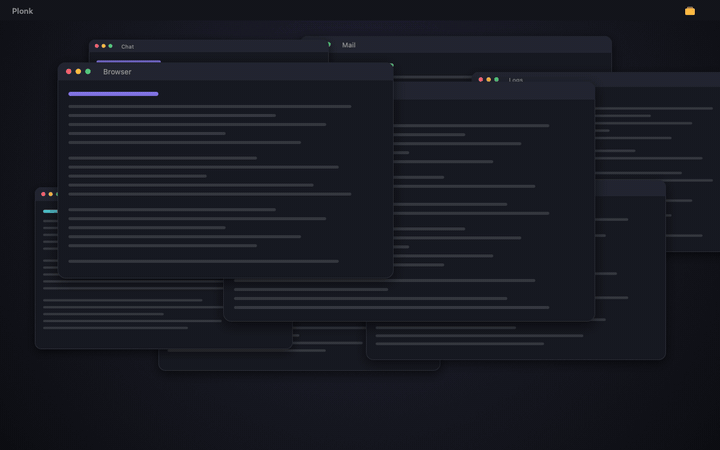
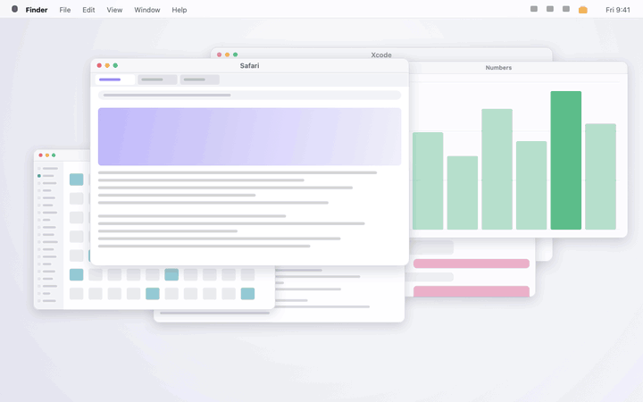
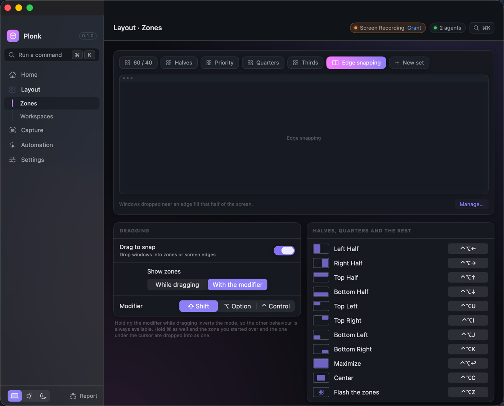
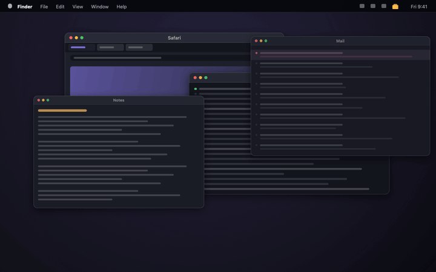
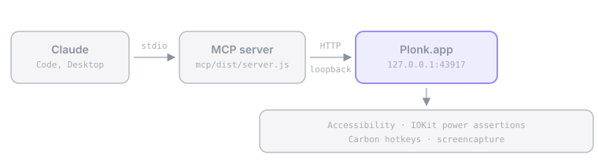

<h1 align="center">Plonk</h1>

<p align="center"><strong>A Mac window manager with zones you draw yourself, plus
nine more menu bar utilities behind the same icon.</strong><br>
<sub>To plonk is to set a thing down exactly where it belongs. You drag it
there, you press a key, or you say where.</sub></p>

<p align="center">
  
  
  
  
  
  
</p>

<p align="center">
  <a href="https://ostapondo.github.io/Plonk/"><strong>ostapondo.github.io/Plonk</strong></a>
</p>

<p align="center">
  
</p>

## Install

macOS 13 or newer.

```sh
brew install --cask ostapondo/plonk/plonk
```

Grant Accessibility when it asks, then relaunch. Screen Recording is asked for
separately, the first time you capture. Nothing else: no Full Disk Access, no
Automation, no Keychain.

<details>
<summary>Installing by hand, and why macOS holds a downloaded copy</summary>

<br>

Plonk is signed but **not notarized**. The certificate is self-signed rather
than an Apple Developer ID, because notarizing needs a paid Apple account and
this project does not have one. So macOS cannot vouch for who built it, and says
so: a hand-downloaded copy is held on first launch. The cask skips that by
clearing the quarantine flag for you.

That is a check being skipped on your behalf, so here is a stronger one to run
instead, before you open anything:

```sh
gh attestation verify $(brew --cache)/downloads/*--Plonk-0.2.4.zip \
  -R ostapondo/plonk
```

It prints the commit and the GitHub Actions run that built this exact archive.
Apple's stamp would tell you a build passed a malware scan; this tells you the
binary came from the source in this repository, with no laptop in between.

Without Homebrew: download [the latest release][rel], unzip, drop Plonk.app into
Applications, then clear the flag yourself, which is all the cask does:

```sh
xattr -dr com.apple.quarantine /Applications/Plonk.app
```

Or do the Gatekeeper detour once: open Plonk, dismiss the warning, then System
Settings, Privacy & Security, scroll to Security, **Open Anyway**.

If you later move or rename Plonk.app, macOS ties the old grant to the old path
and windows of newly launched apps stop being seen. Remove Plonk from Privacy &
Security, Accessibility, and grant it again.

</details>

## Three ways to move a window

**Drag it.** Zones light up as you move a window, and it drops into one. Hold
`⌘` too and it takes two of them at once. Turn on grab-and-move to pull a window
from anywhere inside it instead of aiming for the title bar.

**Press a key.** `⌃⌥←` for the left half. `⌃⌥1` to `⌃⌥9` for the numbered zones
on that screen. `⌃⌥0` puts a window back where it was before Plonk touched it.

**Say it.** Hold `⌃⌥V` and name the place: "snap this left", "zone three". That
runs in the app, offline, on-device.

Five zone sets ship with it. Past those you cut your own: click a zone to split
it, `⇧`-click to split the other way, one set per monitor. Swap the set on a
screen and windows already in a numbered zone move to wherever that number is
now.

<p align="center">
  
</p>

<p align="center">
  
</p>

## What you get

Ten things. The first three are the window manager. The rest are what would
otherwise each be another menu bar icon.

| | |
| --- | --- |
| **[Zones](docs/zones.md)** | Any layout you like, per monitor. Snap by dragging, by number, or by asking. Windows return to their zone after a display is unplugged and plugged back in |
| **[Workspaces](docs/workspaces.md)** | A desk you can put away: the apps, every window's frame, the monitor each belongs on, what each app opens on the way up. Launch it onto an empty desktop and it rebuilds itself |
| **Focus that follows the layout** | `⌃⌥⇧←` goes to the window actually on the left, not the one you used last. `` ⌃⌥` `` cycles the windows stacked in one zone |
| **Text off the screen** | `⌃⌥T` selects an area and copies the words in it: a screenshot, a paused video, a dialog that will not let you select. On-device |
| **Pin part of the screen** | Float a live crop above everything else. A build log, a chart, a call, visible in a corner while you work over it |
| **Keep awake** | Real power assertions, not a jiggler. Sessions end by themselves: after N minutes, at a wall-clock time, or when a process exits |
| **Screenshots** | Region, window or screen, then pen, arrow, rectangle, ellipse, highlighter. Saved at native resolution |
| **A shortcut guide** | Every shortcut the front app actually has, read from its own menus, so it is never out of date |
| **Pointer tools** | Find the cursor, ring every click for a recording, crosshairs, jump to the next display |
| **Voice** | Hold `⌃⌥V` and say it. Common commands run in the app, offline. Anything bigger goes to your agent. Recognition is on-device |

Longer versions: [Zones](docs/zones.md) · [Workspaces](docs/workspaces.md) ·
[Hotkeys](docs/hotkeys.md) · [Everything else](docs/features.md)

## For agents

Plonk exposes its whole surface over MCP, so an agent can read the desk,
rearrange it, save the result, and read the screen back without a screenshot
round trip for anything that is really just words.

```
browser on the left 60%, terminal top right, notes bottom right
save that as a workspace called "review"
keep the Mac awake until this build finishes
read the error out of that dialog and tell me what it says
```

Nineteen tools across state, layouts, workspaces, zones, keep-awake, screenshots
and on-device OCR. Frames are fractions of a monitor's visible area, origin
top-left, so "left 60%" is `{x: 0, y: 0, w: 0.6, h: 1}`. Several agents can
connect at once, each registering itself, with an optional mode that locks
changes to the active one.

<p align="center">
  
</p>

Setup, if you want the `plonk` CLI or an agent driving it (Node 18+):

```sh
claude mcp add plonk -- npx -y plonk-mcp   # Claude Code
codex mcp add plonk -- npx -y plonk-mcp    # Codex CLI
```

In Claude Code it can also be a plugin: same server, pinned to the release it
shipped with rather than to whatever npm serves as latest.

```
/plugin marketplace add ostapondo/plonk
/plugin install plonk@plonk
```

For Claude Desktop there is nothing to type. Download `plonk-<version>.mcpb`
from the [latest release][rel] and open it. The bundle carries the server and
its dependencies, so no config file is edited and nothing is fetched at launch.

Any MCP client works, over stdio or HTTP. One-pagers for
[Cursor](docs/clients/cursor.md), [Zed](docs/clients/zed.md) and
[Cline](docs/clients/cline.md).

The same package carries a `plonk` command, for the things that are neither an
agent nor a settings window:

```sh
plonk state                      # screens, zone sets, workspaces, windows
plonk launch review              # a saved workspace
plonk awake while npm run build  # awake for exactly as long as the build
plonk text | pbcopy              # OCR a region into the clipboard
```

**[For agents](docs/agents.md)** has every tool, the multi-agent rules, the HTTP
transport and the rest of the CLI.

## Privacy

No account, no cloud, no telemetry. The API binds to `127.0.0.1`, refuses
anything carrying headers a browser cannot suppress, and is gated on a token
only you can read. The one outbound connection is the update check, which
carries no identifier and can be switched off.

None of that is a claim you have to take on trust. Releases are built and signed
on GitHub's runners and ship with an attestation, so the binary on your Mac ties
back to the commit it came from:

```sh
gh attestation verify Plonk-<version>.zip -R ostapondo/plonk
```

**[Check it yourself](docs/verify.md)** is every claim above with the command
that tests it. [SECURITY.md](SECURITY.md) is where each one stops.

## Under the hood

<p align="center">
  
</p>

- The app is the single source of truth. The MCP server is a stateless bridge.
- `App/` is the Swift menu bar app, `mcp/` the TypeScript MCP server.
- Config is plain JSON at `~/Library/Application Support/Plonk/config.json`.

## Build

Five commands, and they are what CI runs on every pull request. Each line is a
subshell, so paste the block from the repository root.

```sh
(cd App && swift build)                    # the app compiles
./scripts/test.sh                          # the unit suite
./scripts/lint.sh                          # style rules, no dependencies
(cd mcp && npm ci && npm test)             # the MCP server
node scripts/check-zone-sets.mjs           # the layouts in zone-sets/
```

None of that needs a signing certificate. Zone geometry, config decoding, HTTP
routing, MCP tools, voice parsing, the CLI and every document here are reachable
from that loop, and most changes need nothing more.

Producing a launchable `Plonk.app` does need one. Make your own once with
`./scripts/make-signing-cert.sh`, then run `./scripts/build.sh`. macOS ties
Accessibility and Screen Recording to the code signature, and an ad-hoc one
changes every build, so a stable certificate is what stops rebuilds from
resetting permissions.

## Contributing

Bug reports, zone sets, client one-pagers and code are all welcome. None of them
need a signing certificate.

- **The smallest useful change is one JSON file.** [`zone-sets/`](zone-sets/) is
  a gallery of layouts worth copying: an ultrawide split, a rotated monitor, the
  one built around a recurring meeting. Draw it in the app, read the numbers out
  of `plonk state --json`, open a pull request. That folder has its own CI job
  and answers in about twenty seconds. No build, no signing, no Swift.
- **[good first issue][gfi]** issues are written to be picked up cold. Each says
  where the code is and how to tell it worked, and carries a prompt you can hand
  to an agent, since [AGENTS.md](AGENTS.md) already explains the repo to one.
- **[needs-hardware][hw]** issues need neither Swift nor a certificate, and are
  the most useful thing anyone can send. A window manager breaks on arrangements
  the author cannot see, so a report from three monitors or an ultrawide is
  worth more than a patch.

[CONTRIBUTING.md](CONTRIBUTING.md) has the rest, including how long a review
takes. Questions and half-formed ideas go to
[Discussions](https://github.com/ostapondo/plonk/discussions). A security
problem goes through [SECURITY.md](SECURITY.md), not a public issue. Everyone
taking part follows the [Code of Conduct](CODE_OF_CONDUCT.md).

[gfi]: https://github.com/ostapondo/plonk/issues?q=is%3Aissue+is%3Aopen+label%3A%22good+first+issue%22
[hw]: https://github.com/ostapondo/plonk/issues?q=is%3Aissue+is%3Aopen+label%3Aneeds-hardware
[rel]: https://github.com/ostapondo/plonk/releases/latest

## License

MIT © [ostapondo](https://github.com/ostapondo)
