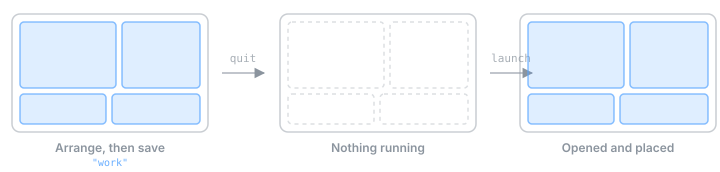
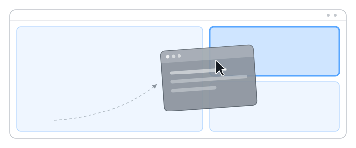
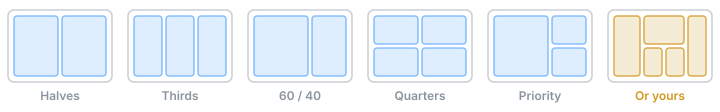

<h1 align="center">Plonk</h1>

<p align="center"><strong>The Mac window manager your AI agent can drive.</strong><br>
<sub>To plonk is to set a thing down exactly where it belongs. This menu bar does it to your windows.</sub></p>

<p align="center">
  
  
  
  
  
  
</p>

<p align="center">
  
</p>

Drag a window, the zones light up, drop it in. Or skip the dragging and say it:

> browser on the left 60%, terminal top right, notes bottom right
>
> save that as a workspace called "review"
>
> keep the screen awake for the next hour
>
> screenshot the screen and tell me what looks off

Everything runs on your Mac. No account, no cloud, no telemetry.

## Install

macOS 13+.

```sh
brew install --cask ostapondo/plonk/plonk
```

Or download [the latest release](https://github.com/ostapondo/plonk/releases/latest),
unzip, and drop Plonk.app into Applications. The build is not notarized yet, so
macOS will balk at the first launch — approve it under System Settings → Privacy
& Security → Open Anyway.

Grant Accessibility when asked, then relaunch. Screen Recording is asked for
separately, the first time you capture. Nothing else — no Full Disk Access, no
Automation, no Keychain.

If you later move or rename Plonk.app (or its folder), macOS quietly ties the
old grant to the old path: windows of newly launched apps stop being seen.
Remove Plonk from Privacy & Security → Accessibility and grant it again.

To let an agent drive it (Node 18+):

```sh
claude mcp add plonk -- npx -y plonk-mcp
```

Or build everything from source: clone the repo, run `./scripts/build.sh`, and
point `claude mcp add plonk -- node …/mcp/dist/server.js` at a locally built
server (`cd mcp && npm install && npm run build`).

## Workspaces

<p align="center">
  
</p>

A workspace is a desk you can put away. It remembers the apps, the frame of
every window, the monitor each one belongs on, and what each app should open on
the way up. Launching one opens whatever is closed, waits for the windows, and
puts them back — from the Workspaces page, or right-click the menu bar icon.

| | |
| --- | --- |
| **Per app** | Files, folders or URLs to open with it: a project folder for an editor, a set of tabs for a browser |
| **Per monitor** | Windows return to the display they were captured on, keyed by display UUID so unplugging a monitor does not scramble them. Or pull the whole workspace onto one screen |
| **Already open** | Running apps get moved, not relaunched. Turn that off to leave them alone and only open what is missing |
| **The catch** | macOS cannot open an app straight into a position, so windows appear first and jump a moment later. A second window of the same app cannot be conjured — give it a file to open instead |

## Zones

<p align="center">
  
</p>

<p align="center">
  
</p>

Five sets ship with it. Everything past that you draw yourself: any number of
zones, any size, overlapping if you want — a narrow rail for chat, a wide middle
split in two, a strip for the terminal. Or describe it and let the agent build
it.

| | |
| --- | --- |
| **Editor** | Click to split, `⇧`-click to split vertically, drag a divider to resize neighbours, `✕` to delete and let them heal over the gap |
| **Per monitor** | Each screen gets its own set, remembered by display, not by index |
| **Overlap** | Allowed — the smallest zone under the cursor wins |
| **Trigger** | On drag, or only with a modifier held. Holding it inverts the mode, so a free move stays one keypress away |
| **Or none** | Edge snapping instead: middles are halves, top is maximize, corners are quarters |

## Hotkeys

<p align="center">
  
</p>

<p align="center">
  All on <code>⌃⌥</code>. Plus <code>⌃⌥Z</code> to flash the zones and <code>⌃⌥S</code> to grab a region.
</p>

## And the rest

| | |
| --- | --- |
| **Keep awake** | IOKit power assertions, not a jiggler. Display-on or system-only, pause on battery, auto while charging, timed sessions, and a menu bar icon that glows while it holds |
| **Screenshots** | Region, window or screen through the native picker, then pen, arrow, rectangle, ellipse and highlighter. Saves at native resolution |
| **Notices** | A panel in the top-right corner, not Notification Center: no permission to ask for, nothing left in your history, and it can show the screenshot instead of describing it |

## For agents

Frames are fractions of a monitor's visible area, origin top-left — which is why
"left 60%" is just `{x: 0, y: 0, w: 0.6, h: 1}`.

| Tool | |
| --- | --- |
| `get_state` | Monitors, every open window and where it sits, zone sets, saved workspaces, awake status |
| `apply_layout` | Place any set of windows, across any number of monitors, in one call |
| `save_workspace` · `launch_workspace` · `delete_workspace` | Named desktops, launched from nothing |
| `snap_window` | Drop a window into a numbered zone |
| `save_zone_set` · `assign_zone_set` · `delete_zone_set` | Snap zones, per monitor |
| `set_awake` | Keep-awake, optionally time-limited |
| `take_screenshot` · `annotate_screenshot` | Capture, mark up, hand the image back |

## Under the hood

<p align="center">
  
</p>

- The app is the single source of truth; the MCP server is a stateless bridge.
- The API binds to `127.0.0.1` and refuses anything carrying browser headers, so
  an open web page cannot drive your desktop.
- No outbound connections, no analytics, zero third-party Swift dependencies.
- Config is plain JSON at `~/Library/Application Support/Plonk/config.json`.

## Build

```sh
cd App && swift build     # the app
./scripts/test.sh         # 112 unit tests
./scripts/build.sh        # produces Plonk.app
cd mcp && npm run build   # the MCP server
```

`App/` is the Swift menu bar app, `mcp/` the TypeScript MCP server. Point an
agent at [AGENTS.md](AGENTS.md) before it touches either.

Releases: bump `MARKETING_VERSION` and `BUILD_NUMBER` in
[version.env](version.env). `scripts/build.sh` reads both into `Info.plist`.

## License

MIT © [ostapondo](https://github.com/ostapondo)
