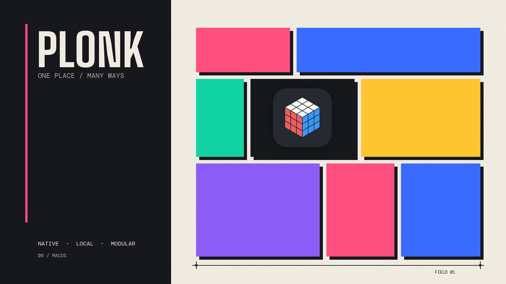

<p align="center">
  
</p>

<h1 align="center">Plonk</h1>

<p align="center"><strong>A toolbox for your Mac, behind one menu bar icon.</strong><br>
Windows, workspaces, screenshots, OCR, a ruler, keep-awake, pointer tools,
shortcuts, voice and agents — native, local and modular.<br>
<sub>To plonk is to set a thing down exactly where it belongs.</sub></p>

<p align="center">
  
  
  
  
  
  
  
  
</p>

<p align="center">
  <a href="https://ostapondo.github.io/Plonk/"><strong>ostapondo.github.io/Plonk</strong></a>
</p>

## One app instead of eight menu bar icons

Plonk is a small suite of macOS tools that share one interface, one command
palette and one automation surface. Use all of it, or switch off every module
you do not need.

**Capture and understand the screen.** Take a region, window or full-screen
screenshot, annotate it, pin a live crop, copy otherwise unselectable text with
on-device OCR, or measure an interface in points and pixels.

**Keep the Mac and your workflow moving.** Hold sleep off until a timer, time of
day or process exit; find the pointer, add crosshairs or click rings; inspect the
front app's real shortcuts; and run anything by name from one palette.

**Arrange the desk.** Draw snap zones, save workspaces that remember each
monitor, move windows by drag, shortcut or voice, and let app rules put new
windows where they belong.

**Let an agent use the same tools.** Plonk ships an MCP server and CLI for
layouts, workspaces, screenshots, OCR, measuring, keep-awake and the rest. The
app stays the source of truth, and the whole surface remains on your Mac.

**It is early.** Version 0.4.x, one author. Shortcuts, zone files and workspaces
are settled. The MCP tool names and the HTTP API are not, and can still change
between minor versions. [CHANGELOG.md](CHANGELOG.md) says what moved.

## Install

macOS 13 or newer, Apple silicon.

```sh
brew install --cask ostapondo/plonk/plonk
```

Grant Accessibility when it asks, then relaunch. Screen Recording is asked for
separately, the first time you capture. Nothing else: no Full Disk Access, no
Automation, no Keychain.

Plonk is signed but not notarized, so macOS holds a copy you download by hand.
The cask takes care of that for you.

Running it alongside Rectangle or Magnet is fine, as long as their shortcuts do
not collide.

**Checking what you downloaded.** Notarizing an app means paying Apple for a
developer account, and this project does not have one, so Plonk is signed with
a certificate it made itself. That means macOS cannot tell you who built the
app. There is a check that answers a more useful question, and you can run it
yourself: was this exact file built by GitHub from the source in this
repository?

```sh
gh attestation verify Plonk-<version>.zip --repo ostapondo/Plonk
```

Put the number from the file name in place of `<version>`. The command comes
with the [GitHub CLI](https://cli.github.com), which is `brew install gh`. It
prints the commit and the workflow run that built the archive. If the file was
altered after it was built, or was not built from this repository at all, the
command fails and tells you so.

Every release also carries a small `Plonk-<version>.zip.sha256` file. Put it
beside the zip and run `shasum -a 256 -c Plonk-<version>.zip.sha256` to confirm
the download arrived complete and unchanged. That file is signed the same way
as the zip, so `gh attestation verify` works on it too. The attestation itself
is also on the release as `Plonk-<version>.zip.sigstore.json`, for anyone who
wants to check it offline with `gh attestation verify --bundle` or with
[cosign](https://github.com/sigstore/cosign) instead of asking GitHub.

<details>
<summary>Installing by hand, Intel Macs, tiling managers, and removing it</summary>

<br>

**Why macOS holds a downloaded copy.** The certificate is self-signed rather
than an Apple Developer ID, because notarizing needs a paid Apple account and
this project does not have one. macOS cannot vouch for who built it, and says
so. The cask skips that check by clearing the quarantine flag for you.

That is a check skipped on your behalf, so here is a stronger one to run before
you open anything:

```sh
gh attestation verify $(brew --cache)/downloads/*--Plonk-*.zip \
  -R ostapondo/plonk
```

It prints the commit and the GitHub Actions run that built this exact archive.
Apple's stamp would tell you a build passed a malware scan. This tells you the
binary came from the source in this repository, with no laptop in between.

**Without Homebrew.** Download [the latest release][rel], unzip, drop Plonk.app
into Applications, then clear the flag yourself, which is all the cask does:

```sh
xattr -dr com.apple.quarantine /Applications/Plonk.app
```

Or do the Gatekeeper detour once: open Plonk, dismiss the warning, then System
Settings, Privacy & Security, scroll to Security, **Open Anyway**.

**If you move or rename Plonk.app** later, macOS ties the old grant to the old
path and windows of newly launched apps stop being seen. Remove Plonk from
Privacy & Security, Accessibility, and grant it again.

**On an Intel Mac.** Releases are built for Apple silicon only, so the download
will not run. Building from source ought to work, see [Build](#build), but
nobody has tried it and a report either way is welcome in [issues][hw].

**Next to a tiling manager.** yabai and Amethyst own every window on screen and
will pull windows straight back out of a zone. Run one or the other.

**Removing it.** `brew uninstall --cask plonk`, or quit Plonk and drag it to the
trash. Then delete `~/Library/Application Support/Plonk/`. The login item goes
with the app, and nothing was written anywhere else.

</details>

## The tools

The modules share settings, shortcuts, the menu bar, the command palette and the
same local API. Turning one off removes its page, menu items, shortcuts, manager
and agent routes while keeping its settings for later.

| | |
| --- | --- |
| **Screenshots and annotation** | Capture a region, window or full screen at native resolution, then add pen strokes, arrows, shapes or highlights before saving |
| **On-device OCR** | `⌃⌥T` copies words from a screenshot, paused video, dialog or locked PDF without uploading a pixel |
| **Screen ruler** | `⌃⌥R` reads clearances and dragged distances in both macOS points and physical pixels |
| **Live crops** | Pin a changing part of the screen above everything else. It streams live and is never written to disk |
| **Pulse** | Keep the Mac awake by timer, schedule, open app, charging state or process lifetime. It uses real power assertions and hands sleep back when the session ends |
| **Pointer tools** | Find the cursor, add configurable crosshairs or click rings, and jump the pointer to the next display |
| **Shortcut guide** | Read every shortcut the front app actually exposes through its menus instead of relying on a stale cheat sheet |
| **[Zones and workspaces](docs/zones.md)** | Draw window places, save apps and documents as a desk, and return everything to the correct displays. [Workspace details](docs/workspaces.md) |
| **Voice, CLI and agents** | Run the same tools by name, from speech, the `plonk` command or twenty-two MCP tools. Recognition for common voice commands stays on-device |

All but the shortcut guide can be switched off, from Tools in the menu bar
dropdown or the Tools page. Off means gone: out of the sidebar, out of the
menu, its shortcuts released, and its tools refused to agents until it is back
on. The same switches cover zones, workspaces and voice, so desk arrangement
can stand down while the rest of Plonk keeps running.

If you are coming from Rectangle, Magnet, Loop or Raycast, the familiar window
shortcuts can come with you. One button imports Rectangle bindings and existing
`rectangle://` scripts need one substitution. [Coming from Rectangle](docs/from-rectangle.md)
has the details.

Longer versions: [Zones](docs/zones.md) · [Workspaces](docs/workspaces.md) ·
[Hotkeys](docs/hotkeys.md) · [Everything else](docs/features.md) ·
[Coming from Rectangle](docs/from-rectangle.md)

## For agents

An agent gets the same toolbox as the menu bar: capture or read the screen,
measure an interface, control an awake session, inspect the desk, arrange it and
save the result.

```
keep the Mac awake until this build finishes
read the error out of that dialog and tell me what it says
how tall is that toolbar, in points and in pixels
capture this window and highlight the warning
put the browser on the left, then save this desk as "review"
```

Twenty-two tools cover state, capture, OCR, measuring, keep-awake, layouts,
workspaces and zones. Several agents can connect at once, each registering
itself, with an optional mode that locks changes to the active one.

Setup, if you want the `plonk` CLI or an agent driving it (Node 18+):

```sh
claude mcp add plonk -- npx -y plonk-mcp   # Claude Code
codex mcp add plonk -- npx -y plonk-mcp    # Codex CLI
```

In Claude Code it can also be a plugin: same server, pinned to the release it
shipped with rather than to whatever npm serves as latest.

```
/plugin marketplace add ostapondo/plonk
/plugin install plonk@plonk
```

For Claude Desktop there is nothing to type. Download `plonk-<version>.mcpb`
from the [latest release][rel] and open it. The bundle carries the server and
its dependencies, so no config file is edited and nothing is fetched at launch.

Any MCP client works, over stdio or HTTP. One-pagers for
[Cursor](docs/clients/cursor.md), [Zed](docs/clients/zed.md) and
[Cline](docs/clients/cline.md).

The same package carries a `plonk` command, for the things that are neither an
agent nor a settings window:

```sh
plonk state                      # screens, zone sets, workspaces, windows
plonk launch review              # a saved workspace
plonk awake while npm run build  # awake for exactly as long as the build
plonk text | pbcopy              # OCR a region into the clipboard
plonk measure 0.5 0.5            # size of what is mid-screen, in points and pixels
```

**[For agents](docs/agents.md)** has every tool, the multi-agent rules, the HTTP
transport and the rest of the CLI.

## Privacy

No account, no cloud, no telemetry. The API binds to `127.0.0.1`, refuses
anything carrying headers a browser cannot suppress, and is gated on a token
only you can read. The one outbound connection is the update check, which
carries no identifier and can be switched off.

None of that is a claim you have to take on trust. Releases are built and signed
on GitHub's runners and ship with an attestation, so the binary on your Mac ties
back to the commit it came from:

```sh
gh attestation verify Plonk-<version>.zip -R ostapondo/plonk
```

**[Check it yourself](docs/verify.md)** is every claim above with the command
that tests it. [SECURITY.md](SECURITY.md) says where each promise stops.

## Under the hood

<p align="center">
  
</p>

- The app is the single source of truth. The MCP server is a stateless bridge.
- `App/` is the Swift menu bar app, `mcp/` the TypeScript MCP server.
- Config is plain JSON at `~/Library/Application Support/Plonk/config.json`.

## Build

Seven commands, and they are what CI runs on every pull request. Each line is a
subshell, so paste the block from the repository root.

```sh
(cd App && swift build)                    # the app compiles
./scripts/test.sh                          # the unit suite
./scripts/lint.sh                          # style rules, no dependencies
(cd mcp && npm ci && npm test)             # the MCP server
node scripts/check-zone-sets.mjs           # the layouts in zone-sets/
node scripts/check-strings.mjs             # every word the user reads
./scripts/check-security-claims.sh         # what SECURITY.md promises
```

None of that needs a signing certificate. Zone geometry, config decoding, HTTP
routing, MCP tools, voice parsing, the CLI and every document here are reachable
from that loop, and most changes need nothing more.

Producing a launchable `Plonk.app` does need one. Make your own once with
`./scripts/make-signing-cert.sh`, then run `./scripts/build.sh`. macOS ties
Accessibility and Screen Recording to the code signature, and an ad-hoc one
changes every build, so a stable certificate is what stops rebuilds from
resetting permissions.

## Contributing

Bug reports, zone sets, client one-pagers and code are all welcome. None of them
need a signing certificate.

- **The smallest useful change is one JSON file.** [`zone-sets/`](zone-sets/) is
  a gallery of layouts worth copying: an ultrawide split, a rotated monitor, the
  one built around a recurring meeting. Draw it in the app, read the numbers out
  of `plonk state --json`, open a pull request. That folder has its own CI job
  and answers in about twenty seconds. No build, no signing, no Swift.
- **[good first issue][gfi]** issues are written to be picked up cold. Each says
  where the code is and how to tell it worked, and carries a prompt you can hand
  to an agent, since [AGENTS.md](AGENTS.md) already explains the repo to one.
- **[needs-hardware][hw]** is where a request for a desk nobody here has gets
  tagged, and answering one needs neither Swift nor a certificate. Desk tools
  meet hardware the author cannot see, so a report from three monitors or an
  ultrawide is worth more than a patch. An empty list is not a filled gap: open
  an issue with the arrangement you have and what happened.

[CONTRIBUTING.md](CONTRIBUTING.md) has the rest, including how long a review
takes. Questions and half-formed ideas go to
[Discussions](https://github.com/ostapondo/plonk/discussions). A security
problem goes through [SECURITY.md](SECURITY.md), not a public issue. Everyone
taking part follows the [Code of Conduct](CODE_OF_CONDUCT.md).

[gfi]: https://github.com/ostapondo/plonk/issues?q=is%3Aissue+is%3Aopen+label%3A%22good+first+issue%22
[hw]: https://github.com/ostapondo/plonk/issues?q=is%3Aissue+is%3Aopen+label%3Aneeds-hardware
[rel]: https://github.com/ostapondo/plonk/releases/latest

## License

MIT © [ostapondo](https://github.com/ostapondo)
