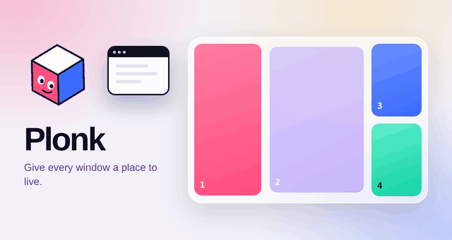
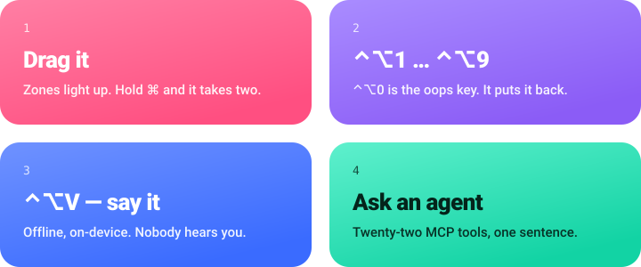
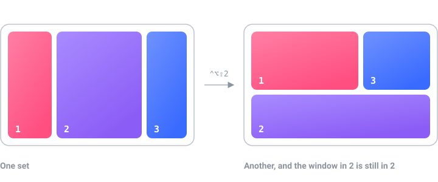
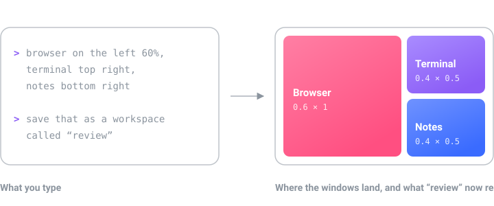

<p align="center">
  
</p>

<h1 align="center">Plonk</h1>

<p align="center"><strong>Give every window a place to live. Draw the boxes you
actually want, then drop windows into them — with a drag, a key, or by saying so
out loud.</strong><br>
<sub>To plonk is to set a thing down exactly where it belongs.</sub></p>

<p align="center">
  
  
  
  
  
  
  
  
</p>

<p align="center">
  <a href="https://ostapondo.github.io/Plonk/"><strong>ostapondo.github.io/Plonk</strong></a>
</p>

## Why another one

You most likely already have Rectangle, Magnet, Loop or Raycast. If a fixed grid
of halves and thirds is all you want, they do it well. Plonk is for three things
they do not do.

Coming from one of them costs nothing: the ten placement shortcuts are the same
keys, one button takes the rest, and an existing `rectangle://` script is one
substitution away. [Coming from Rectangle](docs/from-rectangle.md) is the whole
of it.

**Zones you draw.** Not a preset grid. Any number of zones, any size, a
different set per monitor, overlapping if that suits you. Click a zone to cut it
into top and bottom, right-click to cut it into left and right: a narrow rail
for chat, a wide middle split in two, a strip for the terminal.

**Workspaces that remember which monitor.** Save the desk: the apps, every
window's frame, and the display each one belongs on. Launch it onto an empty
desktop and it rebuilds itself, on the right screens.

**An agent can drive all of it.** Plonk ships an MCP server that covers its
whole surface: layouts, workspaces, zones, keep-awake, screenshots, on-device
OCR, measuring. Generic macOS automation servers can nudge a window around. This
is the window manager itself, so "browser on the left 60%, terminal top right,
save that as a workspace called review" is one sentence rather than a script.

The other seven tools, OCR and a ruler and keep-awake among them, are there
because each was otherwise its own icon in the menu bar.

**It is early.** Version 0.3.x, one author. Shortcuts, zone files and workspaces
are settled. The MCP tool names and the HTTP API are not, and can still change
between minor versions. [CHANGELOG.md](CHANGELOG.md) says what moved.

## Three ways to move a window

<p align="center">
  
</p>

**Drag it.** Zones light up as you move a window, and it drops into one. Hold
`⌘` too and it takes two of them at once. Turn on grab-and-move to pull a window
from anywhere inside it instead of aiming for the title bar.

**Press a key.** `⌃⌥←` for the left half. `⌃⌥1` to `⌃⌥9` for the numbered zones
on that screen. `⌃⌥0` puts a window back where it was before Plonk touched it.

**Say it.** Hold `⌃⌥V` and name the place: "snap this left", "zone three". That
runs in the app, offline, on-device.

Five zone sets ship with it, and past those you draw your own. Swap the set on a
screen and any window already in a numbered zone moves to wherever that number
is now.

<p align="center">
  
</p>

Colour is the zone number, everywhere it is drawn: 1 rose, 2 plum, 3 blue,
4 mint, 5 sun, 6 sky. In the overlay you drag into, in the editor, in the menu
bar, and in every picture on this page. A set can be read before a digit is.

## Install

macOS 13 or newer, Apple silicon.

```sh
brew install --cask ostapondo/plonk/plonk
```

Grant Accessibility when it asks, then relaunch. Screen Recording is asked for
separately, the first time you capture. Nothing else: no Full Disk Access, no
Automation, no Keychain.

Plonk is signed but not notarized, so macOS holds a copy you download by hand.
The cask takes care of that for you.

Running it alongside Rectangle or Magnet is fine, as long as their shortcuts do
not collide.

**Checking what you downloaded.** Notarizing an app means paying Apple for a
developer account, and this project does not have one, so Plonk is signed with
a certificate it made itself. That means macOS cannot tell you who built the
app. There is a check that answers a more useful question, and you can run it
yourself: was this exact file built by GitHub from the source in this
repository?

```sh
gh attestation verify Plonk-<version>.zip --repo ostapondo/Plonk
```

Put the number from the file name in place of `<version>`. The command comes
with the [GitHub CLI](https://cli.github.com), which is `brew install gh`. It
prints the commit and the workflow run that built the archive. If the file was
altered after it was built, or was not built from this repository at all, the
command fails and tells you so.

Every release also carries a small `Plonk-<version>.zip.sha256` file. Put it
beside the zip and run `shasum -a 256 -c Plonk-<version>.zip.sha256` to confirm
the download arrived complete and unchanged. That file is signed the same way
as the zip, so `gh attestation verify` works on it too. The attestation itself
is also on the release as `Plonk-<version>.zip.sigstore.json`, for anyone who
wants to check it offline with `gh attestation verify --bundle` or with
[cosign](https://github.com/sigstore/cosign) instead of asking GitHub.

<details>
<summary>Installing by hand, Intel Macs, tiling managers, and removing it</summary>

<br>

**Why macOS holds a downloaded copy.** The certificate is self-signed rather
than an Apple Developer ID, because notarizing needs a paid Apple account and
this project does not have one. macOS cannot vouch for who built it, and says
so. The cask skips that check by clearing the quarantine flag for you.

That is a check skipped on your behalf, so here is a stronger one to run before
you open anything:

```sh
gh attestation verify $(brew --cache)/downloads/*--Plonk-*.zip \
  -R ostapondo/plonk
```

It prints the commit and the GitHub Actions run that built this exact archive.
Apple's stamp would tell you a build passed a malware scan. This tells you the
binary came from the source in this repository, with no laptop in between.

**Without Homebrew.** Download [the latest release][rel], unzip, drop Plonk.app
into Applications, then clear the flag yourself, which is all the cask does:

```sh
xattr -dr com.apple.quarantine /Applications/Plonk.app
```

Or do the Gatekeeper detour once: open Plonk, dismiss the warning, then System
Settings, Privacy & Security, scroll to Security, **Open Anyway**.

**If you move or rename Plonk.app** later, macOS ties the old grant to the old
path and windows of newly launched apps stop being seen. Remove Plonk from
Privacy & Security, Accessibility, and grant it again.

**On an Intel Mac.** Releases are built for Apple silicon only, so the download
will not run. Building from source ought to work, see [Build](#build), but
nobody has tried it and a report either way is welcome in [issues][hw].

**Next to a tiling manager.** yabai and Amethyst own every window on screen and
will pull windows straight back out of a zone. Run one or the other.

**Removing it.** `brew uninstall --cask plonk`, or quit Plonk and drag it to the
trash. Then delete `~/Library/Application Support/Plonk/`. The login item goes
with the app, and nothing was written anywhere else.

</details>

## What you get

The window manager is four things, and this is the part of each that the
sections above left out.

| | |
| --- | --- |
| **[Zones](docs/zones.md)** | Overlap them, gap them, hide the numbers, keep a list of apps Plonk never touches. Windows return to their zone after a display is unplugged and plugged back in |
| **[Workspaces](docs/workspaces.md)** | Files, folders or URLs each app should open on the way up, so a desk comes back with the right documents and not just the right apps. Monitors are keyed by UUID, so unplugging one does not scramble them |
| **Focus that follows the layout** | `⌃⌥⇧←` goes to the window actually on the left, not the one you used last. `` ⌃⌥` `` cycles the windows stacked in one zone |
| **Voice** | Hold `⌃⌥V` and say it. Common commands run in the app, offline. Anything bigger goes to your agent. Recognition is on-device |

And the [MCP server](#for-agents), which is every one of these as a tool an
agent can call.

<details>
<summary>Seven smaller things, behind the same menu bar icon</summary>

<br>

| | |
| --- | --- |
| **Text off the screen** | `⌃⌥T` selects an area and copies the words in it: a screenshot, a paused video, a dialog that will not let you select. On-device |
| **A ruler** | `⌃⌥R`, then hover: how far the pointer can go each way before it meets an edge, read off the pixels. The width of a row, the height of a bar, the gap between two things. Drag for a straight-line distance. Points and pixels both |
| **Pin part of the screen** | Float a live crop above everything else. A build log, a chart, a call, visible in a corner while you work over it |
| **Pulse** | Real power assertions, not a jiggler, and one switch further: also hold your chat status at available, which is the one thing here that fakes input, because Slack and Teams read the idle clock and an assertion never touches it. Sessions start by hand, on a schedule, while an app is open or while charging, and end by themselves: after N minutes, at a wall-clock time, or when a process exits. A lid-closed hold keeps the Mac running with the lid shut, and hands sleep back when you switch it off |
| **Screenshots** | Region, window or screen, then pen, arrow, rectangle, ellipse, highlighter. Saved at native resolution |
| **A shortcut guide** | Every shortcut the front app actually has, read from its own menus, so it is never out of date |
| **Pointer tools** | Find the cursor, ring every click for a recording, crosshairs, jump to the next display. The ring, the crosshairs and the circle each take a colour, a size and a weight, and right clicks can carry a colour of their own |

All but the shortcut guide can be switched off, from Tools in the menu bar
dropdown or the Tools page. Off means gone: out of the sidebar, out of the
menu, its shortcuts released, and its tools refused to agents until it is back
on. The same switches cover zones, workspaces and voice, so the window manager
itself can stand down and leave the rest running.

</details>

Longer versions: [Zones](docs/zones.md) · [Workspaces](docs/workspaces.md) ·
[Hotkeys](docs/hotkeys.md) · [Everything else](docs/features.md) ·
[Coming from Rectangle](docs/from-rectangle.md)

## For agents

An agent can read the desk, rearrange it, save the result, and read text back
off the screen, with no screenshot round trip for anything that is really just
words.

```
browser on the left 60%, terminal top right, notes bottom right
save that as a workspace called "review"
keep the Mac awake until this build finishes
read the error out of that dialog and tell me what it says
how tall is that toolbar, in points and in pixels
```

Twenty tools across state, layouts, workspaces, zones, keep-awake,
screenshots, on-device OCR and measuring. Frames are fractions of a monitor's
visible area, origin top-left, so "left 60%" is `{x: 0, y: 0, w: 0.6, h: 1}`.
Several agents can connect at once, each registering itself, with an optional
mode that locks changes to the active one.

<p align="center">
  
</p>

Setup, if you want the `plonk` CLI or an agent driving it (Node 18+):

```sh
claude mcp add plonk -- npx -y plonk-mcp   # Claude Code
codex mcp add plonk -- npx -y plonk-mcp    # Codex CLI
```

In Claude Code it can also be a plugin: same server, pinned to the release it
shipped with rather than to whatever npm serves as latest.

```
/plugin marketplace add ostapondo/plonk
/plugin install plonk@plonk
```

For Claude Desktop there is nothing to type. Download `plonk-<version>.mcpb`
from the [latest release][rel] and open it. The bundle carries the server and
its dependencies, so no config file is edited and nothing is fetched at launch.

Any MCP client works, over stdio or HTTP. One-pagers for
[Cursor](docs/clients/cursor.md), [Zed](docs/clients/zed.md) and
[Cline](docs/clients/cline.md).

The same package carries a `plonk` command, for the things that are neither an
agent nor a settings window:

```sh
plonk state                      # screens, zone sets, workspaces, windows
plonk launch review              # a saved workspace
plonk awake while npm run build  # awake for exactly as long as the build
plonk text | pbcopy              # OCR a region into the clipboard
plonk measure 0.5 0.5            # size of what is mid-screen, in points and pixels
```

**[For agents](docs/agents.md)** has every tool, the multi-agent rules, the HTTP
transport and the rest of the CLI.

## Privacy

No account, no cloud, no telemetry. The API binds to `127.0.0.1`, refuses
anything carrying headers a browser cannot suppress, and is gated on a token
only you can read. The one outbound connection is the update check, which
carries no identifier and can be switched off.

None of that is a claim you have to take on trust. Releases are built and signed
on GitHub's runners and ship with an attestation, so the binary on your Mac ties
back to the commit it came from:

```sh
gh attestation verify Plonk-<version>.zip -R ostapondo/plonk
```

**[Check it yourself](docs/verify.md)** is every claim above with the command
that tests it. [SECURITY.md](SECURITY.md) says where each promise stops.

## Under the hood

<p align="center">
  
</p>

- The app is the single source of truth. The MCP server is a stateless bridge.
- `App/` is the Swift menu bar app, `mcp/` the TypeScript MCP server.
- Config is plain JSON at `~/Library/Application Support/Plonk/config.json`.

## Build

Seven commands, and they are what CI runs on every pull request. Each line is a
subshell, so paste the block from the repository root.

```sh
(cd App && swift build)                    # the app compiles
./scripts/test.sh                          # the unit suite
./scripts/lint.sh                          # style rules, no dependencies
(cd mcp && npm ci && npm test)             # the MCP server
node scripts/check-zone-sets.mjs           # the layouts in zone-sets/
node scripts/check-strings.mjs             # every word the user reads
./scripts/check-security-claims.sh         # what SECURITY.md promises
```

None of that needs a signing certificate. Zone geometry, config decoding, HTTP
routing, MCP tools, voice parsing, the CLI and every document here are reachable
from that loop, and most changes need nothing more.

Producing a launchable `Plonk.app` does need one. Make your own once with
`./scripts/make-signing-cert.sh`, then run `./scripts/build.sh`. macOS ties
Accessibility and Screen Recording to the code signature, and an ad-hoc one
changes every build, so a stable certificate is what stops rebuilds from
resetting permissions.

## Contributing

Bug reports, zone sets, client one-pagers and code are all welcome. None of them
need a signing certificate.

- **The smallest useful change is one JSON file.** [`zone-sets/`](zone-sets/) is
  a gallery of layouts worth copying: an ultrawide split, a rotated monitor, the
  one built around a recurring meeting. Draw it in the app, read the numbers out
  of `plonk state --json`, open a pull request. That folder has its own CI job
  and answers in about twenty seconds. No build, no signing, no Swift.
- **[good first issue][gfi]** issues are written to be picked up cold. Each says
  where the code is and how to tell it worked, and carries a prompt you can hand
  to an agent, since [AGENTS.md](AGENTS.md) already explains the repo to one.
- **[needs-hardware][hw]** is where a request for a desk nobody here has gets
  tagged, and answering one needs neither Swift nor a certificate. A window
  manager breaks on arrangements the author cannot see, so a report from three
  monitors or an ultrawide is worth more than a patch. An empty list is not a
  filled gap: open an issue with the arrangement you have and what happened.

[CONTRIBUTING.md](CONTRIBUTING.md) has the rest, including how long a review
takes. Questions and half-formed ideas go to
[Discussions](https://github.com/ostapondo/plonk/discussions). A security
problem goes through [SECURITY.md](SECURITY.md), not a public issue. Everyone
taking part follows the [Code of Conduct](CODE_OF_CONDUCT.md).

[gfi]: https://github.com/ostapondo/plonk/issues?q=is%3Aissue+is%3Aopen+label%3A%22good+first+issue%22
[hw]: https://github.com/ostapondo/plonk/issues?q=is%3Aissue+is%3Aopen+label%3Aneeds-hardware
[rel]: https://github.com/ostapondo/plonk/releases/latest

## License

MIT © [ostapondo](https://github.com/ostapondo)
