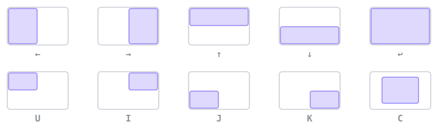

# Hotkeys

  

  All on <code>⌃⌥</code>. Every one of them is rebindable, and any of them can be unbound.

| | |
| --- | --- |
| `⌃⌥` arrows, `U I J K`, `↩`, `C` | Halves, quarters, maximize, centre |
| `⌃⌥1`–`⌃⌥9`, `⌃⌥0` | Into a numbered zone, or back where it was |
| `⌃⌥⇧1`–`⌃⌥⇧9` | Swap the whole zone set on this screen |
| `⌃⌥⇧` arrows | Focus the window that is actually in that direction |
| `` ⌃⌥` `` | Next window in this zone |
| `⌃⌥Z` | Flash the zones |
| `⌃⌥S` · `⌃⌥T` | Grab a region · lift the text out of one |
| `⌃⌥P` · `⌃⌥⇧P` | Pin a live crop on top · pin a still one |
| `⌃⌥⇧/` | Every shortcut the front app has |
| `⌃⌥/` · `⌃⌥\` | Find the pointer · jump it to the next screen |
| `⌃⌥V` | Hold to talk |
| `⌃⌥A` | Command palette — run anything by name, or type a sentence for the agent |

---

[Zones](zones.md) · [Workspaces](workspaces.md) · [Everything else](features.md) · [README](../README.md)
